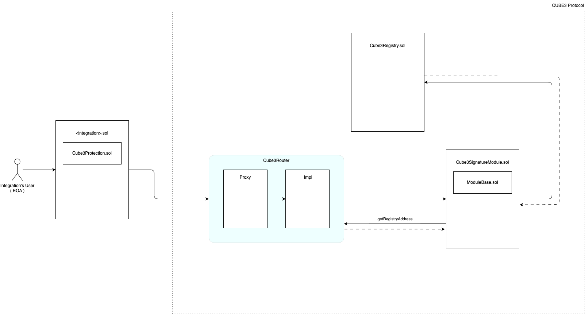

# CUBE3 Protocol Core [![Github Actions][gha-badge]][gha] [![Coverage][codecov-badge]][codecov] [![Foundry][foundry-badge]][foundry]

<!-- [gha]: https://github.com/sablier-labs/v2-core/actions
[gha-badge]: https://github.com/sablier-labs/v2-core/actions/workflows/ci.yml/badge.svg
[codecov]: https://codecov.io/gh/sablier-labs/v2-core
[codecov-badge]: https://codecov.io/gh/sablier-labs/v2-core/branch/main/graph/badge.svg -->

[foundry]: https://getfoundry.sh
[foundry-badge]: https://img.shields.io/badge/Built%20with-Foundry-FFDB1C.svg

This repository contains the core smart contracts of the CUBE3 Protocol. If you're looking for the abstract contracts you can inherit to create your own integration and gain access to this protocol, you can find them in the [cube-web3/protection-solidity](https://github.com/cube-web3/protection-solidity) repository.

In-depth documentation of the offchain services offered by CUBE3 that are used in conjunction with this onchain protocol can be found at [docs.cube3.io](https://docs.cube3.io/).

## Overview

At its core the CUBE3 Protocol is a set of smart contracts that enable on-chain RASP (Runtime Application Self-Protection) functionality for any smart contract that registers as an integration. An "integration" is defined as any smart contract that inherits one of the [CUBE3 Protection abstractions](https://github.com/cube-web3/protection-solidity/tree/main/src), and registers on-chain with the protocol. An integration can then protect specific functions by applying the `cube3Protected` modifier to any `public`/`external` function. The integration administrator then has function-level control over which functions to enable/disable protection for at any given time. When used in conjunction with CUBE3's Risk API, transactions that possess a risk score above a specific threshold can have their execution blocked on-chain (ie. reverted).

CUBE3's Blockchain RASP Product, a W3AF (Web3 Application Firewall) is a security tool that protects Web3 applications and smart contracts from malicious contract interactions. It works by monitoring and filtering incoming traffic to a Web3 application (dApp) or smart contract, using a set of rules to identify and block malicious requests, while allowing legitimate traffic to pass through. The rules used by a W3AF can include filters for common attack types such as re-entrancy, unchecked low-level calls (and more), known exploits, OFAC-sanctioned addresses and more. The contracts contained in this repository enable such functionality.

## Acknowledgements

- The CUBE3 Protocol relies on the operation and availability of the off-chain CUBE3 services. The CUBE3 services are provided by [CUBE3](https://cube3.io/), a company that provides security services for smart contracts and Web3 applications. From this standpoint, the CUBE3 Protocol is not fully decentralized, and thus provides mechanisms for integrations to disconnect themselves from the protocol should they so wish.
- The Protocol cannot intentionally revert an integration's transactions. A delinquent or malicious integration can only be denied access to the modules by having the router return early and bypassing the functionality offered by the Security Modules.

## Architecture

In addition to focusing on security, the protocol was designed with extendability and extensibility as core features. Additional functionality can be added to the system via the installation of application-specific Security Modules.



## Key Concepts

#### An Integration

CUBE3 provides abstract contracts that can be inherited to provide access to the abovementioned protection capabilities through the use of the `cube3Protected` modifier provided by the abstraction. Once your contract that inherits from an abstraction has registered on-chain with the router, it is then referred to as an "integration".

### The Router

The router is designed for maximum flexibility. Given that the functionality of the `cube3Protected` modifier cannot exist without the accompanying CUBE3 services, flexibility and customization take precedence over immutability. As such, the Cube3RouterImpl achieves upgradeability by conforming to the UUPS spec. An integration needs to register with the Router before it can enable any function protections. Registration is further restricted through the use of a registrar signature generated by CUBE3. The signature is signed using the private key for the integration's signing authority, a dedicated account managed by the CUBE3 KMS. In order to register an integration on-chain, the signature needs to be retrieved from the CUBE3 dApp.

#### The Registry

The registry stores the signing authority for each customer integration. A signing authority is the account derived from the private-public keypair generated for each integration and stored in CUBE3's KMS on behalf of each integration.

#### Security Modules

Application-specific smart contracts that provide dedicated per-contract functionality to CUBE3’s on-chain protocol. The `Cube3RouterImpl` is responsible for routing transactions to designated modules, which will be covered in more detail in the Payload Routing section.

#### Signature/Signing Authority

A signing authority is a dedicated account created and managed by CUBE3 for each integration. The account address derived from the public key is stored on-chain in the CUBE3 Registry as the `signingAuthority` for your integration, while the private key is stored in the CUBE3 KMS. The KMS is unidirectional, and CUBE3 does not have direct access to the private key. The Signing Authority's only role is to sign data off-chain so that it can be validated on-chain, the authority has no privileged read/write access to your integration.

#### Routing and Payloads

An integration has access to all the functionality offered by the available Security Modules. The Router is responsible for getting your integration's transaction data to the correct Security Module by extracting data from the payload included in the transaction's calldata. For an in-depth overview of how routing works within the payload, please review the [routing docs](./docs/routing/README.md). This explains the relationship between the CUBE3 Payload, the Module Payload, and the Routing Bitmap in great detail.

## Installation

Clone the repository:

```bash
git@github.com:cube-web3/protocol-core-solidity.git
```

cd into the `protocol-core-solidity` directory and run:

```bash
forge install
```

## Debugging

You can generage a list of all the function and error selectors in this repository using:

```
forge selectors list
```

or by visiting [Sam CZ Sun's signature database](https://openchain.xyz/signatures) and entering the selector.

## Testing

You can run all unit tests using the following command:

```bash
forge test -vvv
```

You can view the coverage report by running:

```bash
forge coverage --report lcov && genhtml lcov.info --branch-coverage --output-dir coverage
```

and opening the `coverage/index.html` file.
