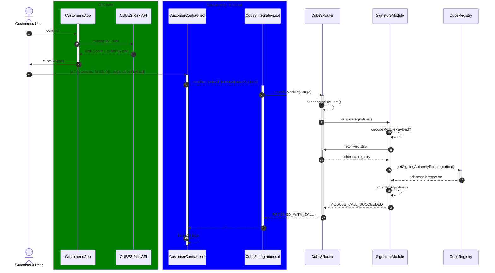

# CUBE3 Protocol Audit Overview

## Introduction

This scoping document covers both this repository (protocol-core-solidity) and the [protection-solidity](https://github.com/cube-web3/protection-solidity) repository.

This repo contains V2 of the CUBE3 protocol. V2 is a complete rewrite of the original protocol. While functionally similar, this new version of the protocol contains significant differences when compared to the [first version](https://github.com/cube-web3/cube3-protocol). The primary motivation for the re-write is to address customer concerns and focus on the following:

- Reduce complexity
- Improve readability
- Lower contract size of inheritable protection contracts
- Reduce gas usage
- Improve the user and developer experience

The main areas of change include:

**Architecture**

- The core protocol and inheritable protection contract have been separated into separate repositories. There's no need for a user to add the protocol or its dependencies to their codebase. The contracts required to create an integration can be found in the [protection-solidity](https://github.com/cube-web3/protection-solidity) repo.
- The `Cube3Registry` is now a singleton and is no longer upgradeable.
- The `Cube3GateKeeper` has been removed from the protocol.

**Integration/Protection Contracts**

- Removed all external dependencies, ie `OpenZeppelin`.
- No longer includes or requires access control.
- All protection logic has been moved to the `Cube3RouterImpl`.
- Introduced ERC7201 storage layout.
- All implementations, ie proxy/singletons, share a single base contract.

**Router**

- Contains all protection logic for integration contracts. Users now call the Router directly to update protection logic.
- New inheritance structure, with integration management and protocol management separated into separate abstract contracts.
- Implements ERC7201 namespaced storage layout.
- Dedicated getters and setters are used for all storage read/writes.
- Removed the concept of `AuthorizationStatus`.
- The Router itself no longer has the ability to revert user transactions. The Router can only return early, forcing the top-level call to bypass routing functionality if access is revoked.
- The Router is now pausible, which will bypass routing and return early.

**Registry**

- The registry is now a singleton and no longer upgradeable.
- No longer uses an invalidation nonce.
- The registry contract can be deprecated and replaced with a new registry contract. This would likely only happen in the event of a KMS compromise.

**Payload Layout**

- Routing information is now included as the last word of the payload, instead of as a header, making it easier to extract from calldata.
- All routing data is packed into a `uint256` bitmap.

# Protocol Properties

Please review the repositories [README](../../../README.md) for a high-level overview of the Protocol.

TODO: complete

- The Core Protocol provides on-chain security features for smart contracts that inherit the ancillary protection contracts.
- In order to make use of CUBE3's on-chain protocol, the integration contract must receive data provided by CUBE3's off-chain services.
- An integration can disconnect from the protocol at any time, or be disconnected from the protocol by CUBE3. From a user-standpoint, disconnecting prevents calls to the router from taking place. Disconnection from the protocol side still requires a call to the Router, which will return early and bypass the protocol's functionality.

## Storage

Both the Core Protocol and Protection abstractions make use of `ERC7201` namespaced storage layout. This serves a dual purpose of helping to prevent storage collisions for upgradeable contracts, and to help reduce transaction costs by facilitating the use of an `accessList` to pre-warm the storage slots we know will be accessed during all transactions - introduced in `EIP-2930`.

Both the protection contracts and the core protocol share the storage namespace of `cube3.storage`, with the start of storage layout assigned to the slot: `0xd26911dcaedb68473d1e75486a92f0a8e6ef3479c0c1c4d6684d3e2888b6b600`, which is derived from:

```solidity
keccak256(abi.encode(uint256(keccak256("cube3.storage")) - 1)) & ~bytes32(uint256(0xff));
```

## Access Control and Roles

### Integration Access Control

Privileged access to integration-specific functionality is controlled by the `Cube3RouterImpl`. Each integration is assigned an `integrationAdmin`, which is set by the integration contract during deployment. The `integrationAdmin` is the only address that can update the integration's protection logic and access is inforced by the `onlyIntegrationAdmin` modifier. This admin account is modelled after OpenZeppelin's `Ownable2Step` pattern, which requires a nominated account to confirm the change of ownership. All functions exposed externally to integration admins can be located in the abstract `IntegrationManagement.sol` contract.

### Protocol Access Control

Administration and management of the protocol is restricted to the CUBE3 team and makes use of OpenZeppelin's `AccessControl` (and its upgradeable variant). Separation of concerns is achieved through different roles and permissions. All roles are defined in the abstract `ProtocolAdminRoles.sol` contract, which is inherited by both the Router and the Registry contracts. The roles and their permissions are as follows:

`CUBE3_PROTOCOL_ADMIN_ROLE` - Assigned to members of the CUBE3 team with the ability to configure the protocol. The protocol admin role has the ability to update the protocol's configuration, install and deprecate modules, and execute privileged calls on modules via the router. Primarily controls access to functions in `ProtocolManagement.sol`. This role should be assigned to a multi-sig controlled by the CUBE3 team.

`CUBE3_INTEGRATION_MANAGER_ROLE` - Assigned to members of the CUBE3 team who can modify an integration's access to the protocol. Accounts assigned this role have the ability to make integration-level changes, such as modifying integration registration status (access to the protocol). This role can be assigned to a programmatic account that is controlled by the CUBE3 team. For example, a programmatic account that revokes registration in the event a user stops paying for the off-chain CUBE3 services.

`CUBE3_KEY_MANAGER_ROLE` - Accounts responsible for modifying state of the `Cube3Registry`. This role acts on behalf of the CUBE3 KMS and can set/revoke signing authorities for integration contracts. The scope of this role is limited to the `Cube3Registry` contract.

`DEFAULT_ADMIN_ROLE` - Assigned to the protocol deployer account. This role is used to assign the abovementioned roles to other accounts. The deployer revokes this role from itself after the protocol is deployed and additional roles are assigned.

## Entry Points

### User Entry Points

- A user deploys their integration, which sets the admin account on the router via `{IntegrationManagement-initiateIntegrationRegistration}`.
- A user completes registration by calling `IntegrationManagement-registerIntegrationWithCube3}` on the router. This requires that an off-chain registrar signature is issued by CUBE3. Only the `integrationAdmin` set in the previous step can call this function.
- A user can transfer admin privileges to a new account by calling `{IntegrationManagement-transferIntegrationAdmin}` on the Router. The `pendingAdmin` needs to call `{IntegrationManagement-acceptIntegrationAdmin}` for the transfer of privileges to complete.
- A user can call `{IntegrationManagement-updateFunctionProtectionStatus}` to update the protection status to update the protection status of one or more functions protected by the `cube3Protected` modifier inherited from the abstract `ProtectionBase.sol` contract.

### CUBE3 Entry points

- A CUBE3 account possessing the `CUBE3_INTEGRATION_MANAGER_ROLE` role can update the registration status of one or more integrations using `{IntegrationManagement-batchUpdateIntegrationRegistrationStatus}`.
- A CUBE3 account possessing the `CUBE3_INTEGRATION_MANAGER_ROLE` role can update the registration status of a single integration using `{IntegrationManagement-updateIntegrationRegistrationStatus}`.
- A CUBE3 account possessing the `CUBE3_PROTOCOL_ADMIN_ROLE` role can update the protocol's config, ie the registry address and paused state, by calling `{ProtocolManagement-updateProtocolConfig}` on the router.
- A CUBE3 account possessing the `CUBE3_PROTOCOL_ADMIN_ROLE` role can can pause/unpause the Protocol by calling `{ProtocolManagement-setPausedUnpaused}` on the router.
- A CUBE3 account possessing the `CUBE3_PROTOCOL_ADMIN_ROLE` role can call privileged module functions, for who access is restricted to the router, by calling `{ProtocolManagement-callModuleFunctionAsAdmin}` on the router.
- A CUBE3 account possessing the `CUBE3_PROTOCOL_ADMIN_ROLE` role can install new modules by calling `{ProtocolManagement-installModule}` on the router.
- A CUBE3 account possessing the `CUBE3_PROTOCOL_ADMIN_ROLE` role can deprecate modules by calling `{ProtocolManagement-deprecateModule}` on the router.
- A CUBE3 account possessing the `CUBE3_KEY_MANAGER_ROLE` role can set the signing authority for an integration by calling`{Cube3Registry-setClientSigningAuthority}` on the Registry.
- A CUBE3 account possessing the `CUBE3_KEY_MANAGER_ROLE` role can batch set signing authorities for multiple integrations by `{Cube3Registry-batchSetSigningAuthority}` on the Registry.
- A CUBE3 account possessing the `CUBE3_KEY_MANAGER_ROLE` role can revoke the signing authority for an integration by calling`{Cube3Registry-revokeSigningAuthorityForIntegration}` on the Registry.
- A CUBE3 account possessing the `CUBE3_KEY_MANAGER_ROLE` role can batch revoke signing authorities for multiple integrations by `{Cube3Registry-batchRevokeSigningAuthoritiesForIntegrations}` on the Registry.

### Contract entry points

- Integration contracts access the protocol via the `{Cube3RouterImpl-routeToModule}` function.
- The protocol validates the signature generated by the integration's signing authority via the `{Cube3SignatureModule-validateSignature}` function. Access to the function is restricted to the Router.

### Customer Registration Flow

- Customer deploys their integration on-chain, providing the `integrationAdmin` address to the `Cube3Protection` constructor.
- The customer contracts makes a call to `initiateIntegrationRegistration` inside the constructor, pre-registering the integration and setting the admin account.
- Customer logs into the CUBE3 web portal
- Customer goes to "register integration" page.
- Customer inputs their integration contract address and hits 'Submit'
- CUBE3 front-end hits api point requesting registration token
- CUBE3 back-end generates a public-private key pair and adds it to the CUBE3 KMS
- CUBE3 back-end creates a registration token (essentially an ephemeral on-chain API key) by signing a hash of the abi.encoded customer's contract addresses as well as the implementation's security admin account which is fetched directly from the integration contract, along with the chain ID
- CUBE3 back-end submits a transaction using the KEY_MANAGER private key which registers the key-pair's public address as the signing authority for the integration in the Cube3Registry
- Customer waits for the on-chain transaction to finalize
- CUBE3 back-end returns the registrar signature (essentially a 65-byte ECDSA signature) to the front-end
- Customer selects which functions decorated with the cube3protected modifier they wish to enable by default
- CUBE3 front-end auto-populates the registerIntegrationWithCube3 transaction data with the registrarSignature and the array of function selectors
- Customer clicks 'Submit' which makes a call to the Router's `registerIntegrationWithCube3` function along with the address of the integration, the registrar signature and array of function selectors.
- On-chain, the `Cube3RouterImpl` retrieves the integration's signing authority from the registry, recovers the signer address from the registration token, and if the signing address matches, it completes the registration sets the integration's registration status to the `REGISTERED` enum.

### Typical Transaction Flow

A typical transaction flow for an integration contract that has registered with the protocol and has function protection enabled is as follows:

- A user connects to customer dApp, which calls the CUBE3 Risk API and returns the `cube3Payload` to the user.
- The user calls a function on the customer's integration contract that's decorated with the `cube3Protected` modifier.
- A call is made from the integration contract to the Router's `routeToModule` function.
- The Router checks that the following three conditions are met:
  - Protection is enabled for the function.
  - The integration is registered.
  - The protocol is not paused.
- The Router extracts the module payload and decodes the routing bitmap from the calldata.
- The Router calls `validateSignature` on the signature module.
- The Signature Module retrieves the registry address from the Router.
- The Signature Module retrieves the signing authority for the integration from the registry.
- The Signature Module reconstructs the data used to create the signature and recovers the signer address.
- If the signature is valid and the signer matches, `MODULE_CALL_SUCCEEDED` is returned to the Router.
- The Router returns `PROCEED_WITH_CALL` to the integration.
- The integration proceeds with the top-level function call.



## Attack Considerations

The protocol is ultimately operated and managed by CUBE3. Account compromise of an account owned by CUBE3 with a privileged role is a primary attack vector for any actor wishing to exploit an integration. The same can be said for the KMS managed by CUBE3 for storing signing authorities. While the operational security of these elements is nonetheless important, it's beyond the scope of this audit, which focuses on the on-chain protocol.

There are no funds transferred or custodied by the protocol, so the financial incentives to target the protocol directly are limited. Instead, an attacker may look to exploit the protocol for the sake of exploiting the contracts that make use of it.

V1 of the protocol exposed a limited risk of phishing for integration contracts by controlling function protection via the integration contract's own storage. This risk has been mitigated by moving all function protection logic to the Router.

If an integration's admin was to lose access to their account, or were it to be compromised, CUBE3 cannot recover or change this account. Mitigation would be in the form of disconnecting the integration from the protocol. An integration should use separate accounts for management of the integration from a CUBE3 protocol perspective, and any privileged access on the integration contract itself.

Disconnecting the integration from the integration side via the `{_updateShouldUseProtocol}` **must** only be called within an external/public function protected by access control. It is up to the integration's designer to determine whether or not this feature is required and to implement the mechanism accordingly.

Bypassing the protection logic for an integration is possible via compromised `integrationAdmin` account. The integrity of this account is the sole responsibility of account owner. Another route, albeit more complex, by a malicious actor could involve a combination of phishing and an illegitimate integration registration. Because protection status is stored per integration, per function selector, a malicious actor could in theory attain a registrar signature from CUBE3 and register a malicious integration and disable protection on a function matching the selector of a target integration's contract. The exploit would then require phishing an integration's user to call the unprotected function on the malicious contract. This is of course possible without any involvement of the CUBE3 protocol, with the only perceived benefit being that a "successfully" executed transaction's trace would include traces through the CUBE3 protocol. However, if the malicious contract is detected by CUBE3's RASP service, the transaction would be blocked were it to be routed to the `Cube3SignatureModule`. This is a very high effort, low reward attack vector.

## Scoping Details and Considerations

The protocol and [protection-solidity repo](https://github.com/cube-web3/protection-solidity) are both in scope for this audit and can be considered a single codebase. The core protocol contracts and inheritable protection contracts have been separated into separate repositories to improve the developer experience for anyone wishing to utilize CUBE3's services.

The Protection contracts are included as a dependency in this repo and utilized for all integration testing. The dependencies are included as a git submodule, and are locked to a specific branch for the audit via `.gitmodules`,

The protocol will be deployed on multiple chains, including Ethereum mainnet and various L2s. There is no cross-chain message passing or function execution. All interactions with the protocol on a specific chain are isolated to that chain. Some target EVM chains, such as Avalanche, do not yet support Solidity `>0.8.19` or the `PUSH0` opcode. This was taken into consideration when designing V2 of the protocol.

For chains that do not support `PUSH0`, ie that support `solc < 0.8.20`, the contracts are compiled with `paris` as the EVM target version. This way, we can use the latest solidity features available in `> 0.8.20` for networks that support it, and still deploy to networks that do not. This can be achieved with foundry using the flag: `--evm-version paris` when compiling and deploying.

## Test Coverage

### Integration/Protection Contracts

### Protocol

```bash
| File                                                    | % Lines          | % Statements     | % Branches       | % Funcs          |
|---------------------------------------------------------|------------------|------------------|------------------|------------------|
| src/Cube3Registry.sol                                   | 100.00% (25/25)  | 100.00% (33/33)  | 100.00% (8/8)    | 100.00% (8/8)    |
| src/Cube3RouterImpl.sol                                 | 100.00% (34/34)  | 97.87% (46/47)   | 100.00% (18/18)  | 85.71% (6/7)     |
| src/abstracts/IntegrationManagement.sol                 | 100.00% (67/67)  | 100.00% (84/84)  | 100.00% (32/32)  | 100.00% (9/9)    |
| src/abstracts/ProtocolManagement.sol                    | 100.00% (29/29)  | 100.00% (43/43)  | 100.00% (22/22)  | 100.00% (5/5)    |
| src/abstracts/RouterStorage.sol                         | 100.00% (40/40)  | 100.00% (41/41)  | 100.00% (4/4)    | 100.00% (22/22)  |
| src/libs/AddressUtils.sol                               | 100.00% (6/6)    | 100.00% (8/8)    | 100.00% (4/4)    | 100.00% (2/2)    |
| src/libs/BitmapUtils.sol                                | 100.00% (4/4)    | 100.00% (4/4)    | 100.00% (0/0)    | 100.00% (3/3)    |
| src/libs/RoutingUtils.sol                               | 100.00% (9/9)    | 100.00% (11/11)  | 100.00% (0/0)    | 100.00% (2/2)    |
| src/libs/SignatureUtils.sol                             | 100.00% (4/4)    | 100.00% (6/6)    | 100.00% (2/2)    | 100.00% (1/1)    |
| src/modules/Cube3SignatureModule.sol                    | 100.00% (24/24)  | 100.00% (33/33)  | 100.00% (8/8)    | 100.00% (6/6)    |
| src/modules/SecurityModuleBase.sol                      | 100.00% (21/21)  | 100.00% (30/30)  | 100.00% (8/8)    | 100.00% (3/3)    |
```

## Acknowledgements

- This is not a fully decentralized protocol, as the current iteration relies on CUBE3's off-chain services.
- "Disconnecting" from the protocol comes at the expense of an `SLOAD` per transaction, which is a gas cost that is not currently covered by the protocol. This is a trade-off that was made to improve the developer experience and reduce the complexity of the protocol. The protocol is designed to be as simple as possible, while still providing the necessary security features for smart contracts. Disabling access to the protocol post-deployment requires that the integration contract implements some form of access control.
- The protocol is designed in such a way that new functionality can be introduced without requiring a protocol upgrade. This is achieved by using a `payload` to route transactions to the appropriate contract modules. The only module included in the scope of this audit is the `Cube3SignatureModule`.
- CUBE3 does not have the ability to modify protection status of individual functions for an integration. If an integration's owner were to lose control of the `integrationAdmin` account, there is no way for the protocol to modify this account. This is to increase decentralization. In the event of account compromise or loss of access to an `integrationAdmin` account, CUBE3 has the ability to revoke an integration's registration, which will force the integration to bypass the protocol's functionality and return early, effectively disabling the protocol for the integration and allowing the function call to proceed as normal. Noting that this comes at the expense of additional `SLOAD` operations per transaction, compared to the integration disabling access to the protocol themselves.
- No error is thrown when a function is not protected. An integration admin could unintentionally set protection status for a function that does not make use of the modifier by passing the incorrect selector when updating the status. It's up to the integration admin to confirm that the protection functionality for each function is behaving as expected.
- Removal of the Registry from the Router by a CUBE3 account will cause any subsequent registrations to fail, until a new Registry is installed. It is possible for existing integration to continue to operate if signatures are generated by CUBE3 using the universal backup signer.
