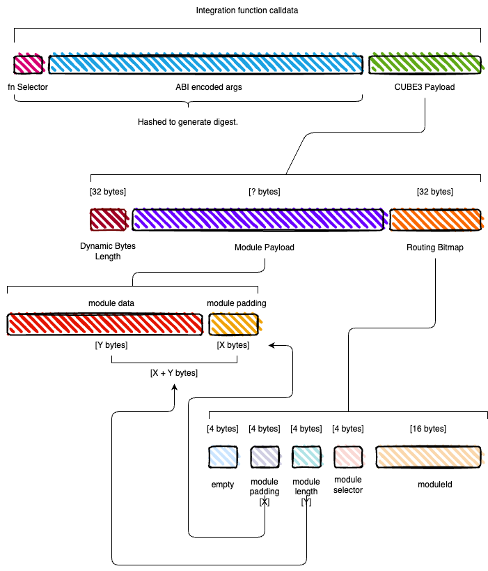
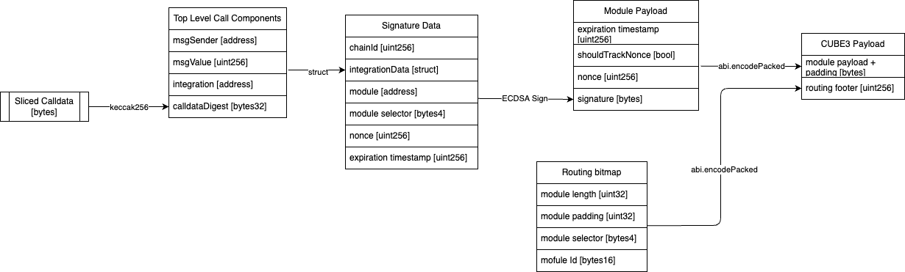

# Routing

The CUBE3 Core Protocol has been designed with extendability and extensibility in mind. The protocol leverages a modular approach to its architecture in favor of simplicity over patterns such as the diamond beacon proxy. At the core of this modular design is the routing system, facilitated by the `Cube3RouterImpl` contract. The Router has two primary responsibilities:

1. Enforcing function protection
2. Payload routing

This document will focus specifically on payload routing.

Functionality offered by the CUBE3 protocol is accessed via the Security Modules. Modules are purpose-built smart contracts that encapsulate a specific set of functionality. The `Cube3RouterImpl` is responsible for routing payloads to the appropriate module, based on the routing information contained within the payload. The routing system is designed to be flexible and extensible, allowing for the addition of new modules and functionality without the need to modify the core protocol. The `CUBE3 payload`, provided off-chain by CUBE3, contains all the data necessary to route the payload to its desired destination. In this way, the protocol's Router is conceptually similar to a traditional network router. A network router routes packets to their destination based on the packet's destination address contained within the packet's header. The CUBE3 Router routes payloads to their destination (modules) based on the payload's routing information, however, unlike a traditional datagram, the CUBE3 protocol's payload is stored at the end of the data (like a footer). This makes the payload easier to parse on-chain, due to it having a known size. Having to parse the routing information from the beginning of the module adds complexity due to the nature of the ABI encoding for function calls.

It's important to understand the information hierarchy of the CUBE3 payload. The CUBE3 payload, which is passed as the last argument to any function protected with the `cube3Protected` modifier, contains two pieces of information: The `Module Payload` and the `Routing Bitmap`.

- The Module Payload contains all the data the module needs to execute the desired functionality. The Module Payload can be of a variable byte length, due to the fact that different modules will require different data to execute their functionality.
- The Routing Bitmap contains all the data the Router requires to get the Module Payload to its destination. The Routing Bitmap is a fixed byte length of `32 bytes`, given that the routing data is packed into a single `uint256` bitmap.

Thus, conceptually, the pseudo code for generating the payload might look something like this: `Module Payload + Routing Bitmap = CUBE3 Payload`

Conceptually, parsing the necessary data to route data to a module is a 3 step process:

1. Extract the CUBE3 payload from the original integration function's calldata. This is passed to the `Cube3RouterImpl` as the `bytes calldata integrationCalldata` argument in the `routeToModule` function.
2. Extract the `Module Payload` and the `Routing Bitmap` from the `CUBE3 Payload`.
3. Extract and generate a keccak256 hash of the integration function's calldata to generate a digest. This digest is then passed along to the module, along with the original call's `msg.value` and `msg.sender`. This allows any module, if desired, to validate that the metadata of the call submitted on chain matches the data provided to CUBE3 off-chain.

Practically, all three steps take place within the `parseRoutingInfoAndPayload` function in the `PayloadUtils` library.

The diagram below provides a visually reference for how the payload data is structured.

**NB: The size of the chunks is not to scale or representative of actual byte length.**



We know that a function's calldata is a sequence of bytes, preceded by the `bytes4` function selector. The `bytes` following the function selector are the ABI encoded function arguments. By design, the CUBE3 payload is required to be the final argument in any protected function call. This means we can be assured that the CUBE3 payload occupies the final `bytes` in the calldata. This is important, as it allows us to easily extract the CUBE3 payload from the calldata, regardless of the payload's length. This is a key design decision, as it allows the protocol to be more flexible and extensible, as new modules can be added without needing to modify the core protocol.

Because of the way encoding of dynamic data types (such as `bytes`) works in ABI encoding, we know that the length of the byte array (a `uint256`) will precede the CUBE3 payload. Depending on the other arguments and data types included in the calldata, the offset for this data will be present somewhere earlier in the calldata, but we need not worry about that for now.

We can easily extract the routing bitmap from the CUBE3 payload (and the calldata) as we know for certain that it occupies the final 32 bytes. The routing bitmap uses little endian ordering, whereby the first piece of data, ie the module ID, starts at the least significant bit. We then utilize assembly to extract the module's ID (`bytes16`), the function selector to be called on the module (`bytes4`), the length of the module payload (`uint32`), and the amount of padding the module required (`uint32`) from the bitmap. The final 4 bytes of the bitmap are left empty. A bitmap is utlized to reduce gas costs by limiting the amount of memory expansion required from 4 words to 1.

The reason we include the required module's padding is that the module payload is generated using `abi.encodePacked` to reduce the amount of data transferred. The inherent issue here is that if we were to leave the module payload is, the ABI encoding of the function call would pack the module payload to fit into the next 32 byte word. Without knowing how much padding was required, it would make extracting the module payload from calldata much more complicated. By padding the packed data ourselves, we know the exact length of the data and where to look for it relative to the Routing Bitmaps position.

Now that the length of the Module Payload is known, we can extract the Module Payload from the calldata. In addition, we can extract the bytes representing the remaining ABI encoded function arguments, along with the function selector, and generate the digest. It's important to note that this data will likely contain the data for the offset of the Module Payload, but this is accounted for when generating the equivalent digest off-chain.

### Module payload layout

```solidity
bytes memory encodedModulePayloadData = abi.encode(
   expirationTimestamp,
   trackNonce,
   userNonce,
   signature
);
```

The next step is to apply padding of zeroes to fill the last word, as previously mentioned. Take note of the trailing zeros after the signature's `s` value (`0x1c`).

```
[000]: 0000000000000000000000000000000000000000000000000000000000015181 [timestamp]
[020]: 0000000000000000000000000000000000000000000000000000000000000001 [shouldTrackNonce]
[040]: 0000000000000000000000000000000000000000000000000000000000000001 [nonce]
[060]: 0000000000000000000000000000000000000000000000000000000000000080 [signature offset] 0x80 = 128 bytes bytes
[080]: 0000000000000000000000000000000000000000000000000000000000000041 [signature length] 0x41 = 65 bytes
[0a0]: 5a5cb72a195205cd56ab0aa564fe38162d3625d539506251f52bb46024188519 [r]
[0c0]: 3c3c70e1bc67dc864e13b62e5cf2085d6e22ab50550d1424e857b2ce627e7869 [v]
[0e0]: 1c00000000000000000000000000000000000000000000000000000000000000 [s] + [padding]

```

## Generating the CUBE3 Payload, the Module Payload and the Routing Bitmap

Creating the CUBE3 Payload is a multi-step process. The diagram below illustrates the layered data and datastructures that comprise the various payloads.



Finally, the `moduleFnSelector`, the original function call's metadata, and the `modulePayload` are used to generate the calldata for the module call.
